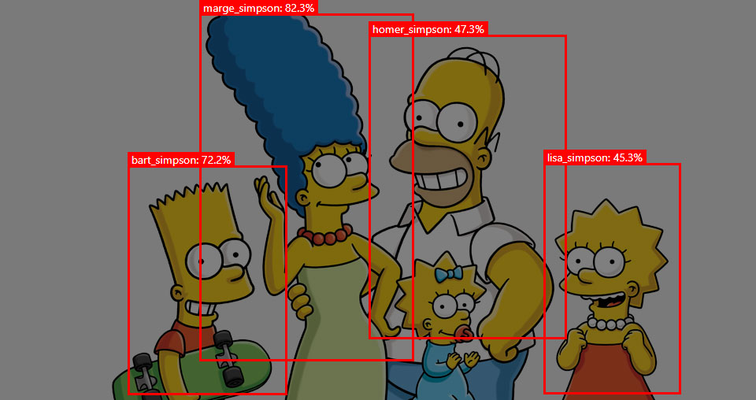
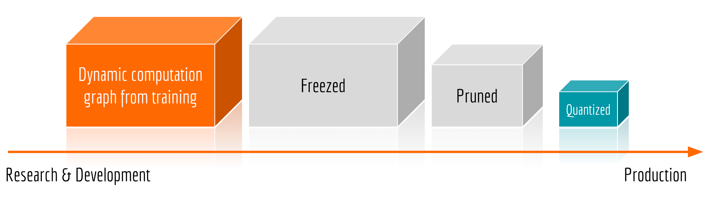

# Tensorflow.js adapted to work with any object detection model


## Description
This site is designed to allow a user to demonstrate the work of his/her model for object detection task via Tensorflow.js interface and WebGL. This repository contains a code to run your own model in a browser using Tensorflow.js. Recently, real-time object-detection was only possible to do with specialised hardware or hard-to-install software with tricky system requirements. Now you can use these models  with any basic webcam or mobile camera. Finally, users can access your applications by just opening a URL(if you host it somewhere). Since all computing is done on the device, the data stays private.

## Limitations (friendly notice)
You should be aware of certain limitations of in-browser computing. After converting your model into a form, understood by Tensorflow.js (quantisation) weights might be quite heavy. For instance, for Faster R-CNN model, weights together weigh about ~100 MB. Loading such a large amount of data required me about 3 minutes of sacred patience. Please be aware if you decide to use this type of solution in production.

## Model preparation
The procedure of connecting the model with this application is pretty much standard.


First, you need to freeze your graph using something like this:
```
python3 export_inference_graph.py \
    --input_type image_tensor \
    --pipeline_config_path training_faster_rcnn_resnet50_coco/faster_rcnn_resnet50_coco.config \
    --trained_checkpoint_prefix 
er_rcnn_resnet50_coco/model.ckpt-3572 \
    --output_directory training_faster_rcnn_resnet50_coco
```
This allows the model to be used for out of the box inference as a frozen graph proto with weights baked into the graph as constants (frozen_inference_graph.pb).

When preparing to run the model, it is useful to understand, which outputs of the model are you going to show in a browser session. To identify what exactly the model returns, please use a `saved_model_cli` [utility](https://www.tensorflow.org/guide/saved_model)). You must see something like:

```
MetaGraphDef with tag-set: 'serve' contains the following SignatureDefs:
signature_def['serving_default']:
  The given SavedModel SignatureDef contains the following input(s):
    inputs['inputs'] tensor_info:
        dtype: DT_UINT8
        shape: (-1, -1, -1, 3)
        name: image_tensor:0
  The given SavedModel SignatureDef contains the following output(s):
    outputs['detection_boxes'] tensor_info:
        dtype: DT_FLOAT
        shape: (-1, 100, 4)
        name: detection_boxes:0
    outputs['detection_classes'] tensor_info:
        dtype: DT_FLOAT
        shape: (-1, 100)
        name: detection_classes:0
    outputs['detection_scores'] tensor_info:
        dtype: DT_FLOAT
        shape: (-1, 100)
        name: detection_scores:0
    outputs['num_detections'] tensor_info:
        dtype: DT_FLOAT
        shape: (-1)
        name: num_detections:0
  Method name is: tensorflow/serving/predict
```

What you need from here, is that there will be 4 arrays: detection_boxes, detection_scores, detection_classes, num_detections.
This model accepts tensors of the shape (-1, -1, -1, 3), which simply means it requires coloured pics as an input. For the output it returns (-1, 100, 4) shape, containing 4 points for the top left (x, y) and the top right (x, y) points.

Then you would rather prune your model, or go straight to the quantisation step, which is necessary to let you model work on TensorFlow.js. This is done using a `tensorflowjs_converter` [utility](https://github.com/tensorflow/tfjs-converter)). Since while using TensorFlow.js, client technically has to download a model only once, since typically such a web model is chunked into 4MB shards (for Fast R-CNN 27 shards are created), such that a browser will cache them. With weight quantisation, we can compress our model parameters from `Float32s` to `Uint8s`.

FrozenModel example:
```
tensorflowjs_converter \
    --input_format=tf_frozen_model \
    --output_node_names='detection_boxes, detection_scores, num_detections, detection_classes' \
    --saved_model_tags=serve \
    training_faster_rcnn_resnet50_coco/frozen_inference_graph.pb \
    training_faster_rcnn_resnet50_coco/web_model
```


## Adapting code


The entire source code of Tensorflow.js projects can be found on GitHub. 
Data processing before and after the prediction are two main steps here. You will need to modify the code to make it work.

In this code, the threshold value has been set to 0.5. This means that all objects with lower probabilities will be filtered out. This threshold might be modified. In the case of the heavier Faster R-CNN models, it is recommended to use a highly reduced number of proposals for speed.

* **[App.js](src/App.js)** - change the number of classes and labels.

* ([model.py](mrcnn/model.py), [utils.py](mrcnn/utils.py), [config.py](mrcnn/config.py)): These files contain the main Mask RCNN implementation. Model.py is changed to work with a multiclass classification.


This project was bootstrapped with [Create React App](https://github.com/facebook/create-react-app).

## Getting Started

In the project directory, you can run:

### `npm start`

Runs the app in the development mode.<br>
Open [http://localhost:3000](http://localhost:3000) to view it in the browser.

The page will reload if you make edits.<br>
You will also see any lint errors in the console.

### `npm test`

Launches the test runner in the interactive watch mode.<br>
See the section about [running tests](https://facebook.github.io/create-react-app/docs/running-tests) for more information.

### `npm run build`

Builds the app for production to the `build` folder.<br>
It correctly bundles React in production mode and optimizes the build for the best performance.

The build is minified and the filenames include the hashes.<br>
Your app is ready to be deployed!

See the section about [deployment](https://facebook.github.io/create-react-app/docs/deployment) for more information.

### `npm run eject`

**Note: this is a one-way operation. Once you `eject`, you can’t go back!**

If you aren’t satisfied with the build tool and configuration choices, you can `eject` at any time. This command will remove the single build dependency from your project.

Instead, it will copy all the configuration files and the transitive dependencies (Webpack, Babel, ESLint, etc) right into your project so you have full control over them. All of the commands except `eject` will still work, but they will point to the copied scripts so you can tweak them. At this point you’re on your own.

You don’t have to ever use `eject`. The curated feature set is suitable for small and middle deployments, and you shouldn’t feel obligated to use this feature. However, we understand that this tool wouldn’t be useful if you couldn’t customize it when you are ready for it.

## License
Copyright (c) 2019 Ekaterina Lyapina. Contact me for commercial use (or rather any use that is not academic research) (email: aegorfk at gmail.com). Free for research use, as long as proper attribution is given and this copyright notice is retained.
